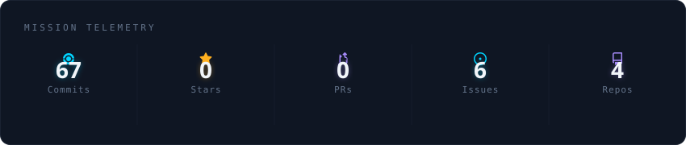

  

 

  

 

  

 

  

 

<strong>More about me</strong>

 
Hello, my name is Vinícios. I am a Back-End Developer in training, focused on building RESTful APIs and web applications using <b>Python (Flask)</b> and <b>Java (Spring Boot)</b>.

I have experience working with relational databases such as <b>MySQL</b> and <b>PostgreSQL</b>, using <b>Firebase/Firestore</b>, implementing authentication flows, and consuming external APIs.

Additionally, I have experience with <b>Android Development in Java</b>, which allows me to understand the full communication flow between frontend applications, mobile clients, and the backend.

I am currently in my <b>3rd Semester of Software Engineering</b> and continuously improving my skills in programming logic, software architecture, and best development practices.

<b>Technologies:</b> Python (Flask), Java (Spring Boot), RESTful APIs, MySQL, PostgreSQL, Firebase/Firestore, JavaScript, Git, basic software architecture, Scrum and Kanban.

I am seeking opportunities as a <b>Junior Back-End Developer</b> or <b>Intern</b>, where I can grow technically and contribute with efficient and well-structured solutions.

 

  
  

# ViniciosTorres-Dev
